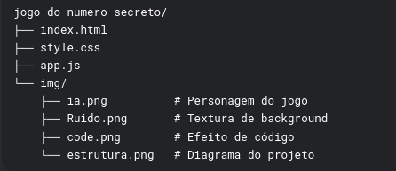

# 🎮 Sobre o Jogo

Um jogo simples onde o objetivo é adivinhar um número secreto entre 1 e 10. Desenvolvido com HTML, CSS e JavaScript puro.

__Link do jogo no Vercel:__ https://jogo-do-numero-secreto-black-eight.vercel.app/

***

# :hammer: Funcionalidades

* Geração aleatória de números sem repetição até todos serem usados
* Dicas se o número secreto é maior ou menor que o palpite
* Contagem de tentativas
* Reinício automático do jogo
* Design responsivo

*** 

# 🛠 Tecnologias Utilizadas

* __Frontend:__

  * HTML5  
  * CSS3
  * JavaScript Vanilla

* __Hospedagem:__

  * Vercel (deploy automático via integração com GitHub)

***

# 🚀 Como Executar Localmente

1. * Clone o repositório:
`git clone https://github.com/plucasm/jogo-do-numero-secreto.git`
2. * Acesse a pasta do projeto:
`cd jogo-do-numero-secreto`
3. * Abra o arquivo ìndex.html` no navegador

***

# 📂 Estrutura de Arquivos

  

***

# 🎯 Regras do Jogo

1. O sistema gera um número aleatório entre 1 e 10
2. Você deve adivinhar qual é esse número
3. A cada palpite errado, o jogo informa se o número secreto é maior ou menor
4. Quando acertar, mostra quantas tentativas foram necessárias

***

# 🔧 Personalização

Você pode facilmente modificar:

* O intervalo de números (altere `numeroLimite` no arquivo JS)
* As mensagens exibidas
* O estilo visual no CSS
